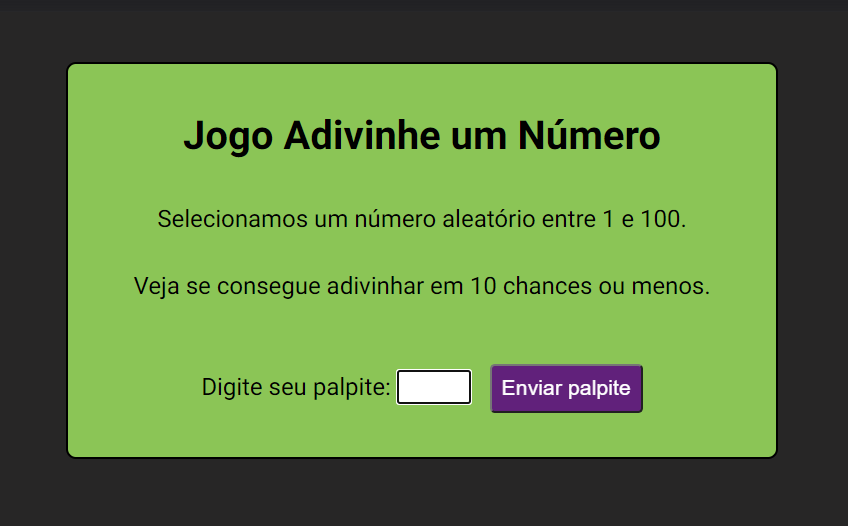

# Jogo Adivinhe um Número 💯

Jogo feito em HTML, CSS e JavaScript, com layout responsivo.

Link para o site: https://gabivechiatto.github.io/Jogo_Adivinhe_um_Numero/

 
 
<h2>Como usar?</h2>

1. O jogo escolhe um número aleatório entre 1 e 100 e o usuário deve adivinhá-lo.

2. Digite seu palpite no campo e clique em Enviar palpite.

3. O jogo te dará dicas se seu palpite está muito acima ou muito abaixo do número que ele pensou.

4. Tente acertar em 10 chances. Boa sorte!

<h2>Licença</h2>

MIT (Massachusetts Institute of Technology)

